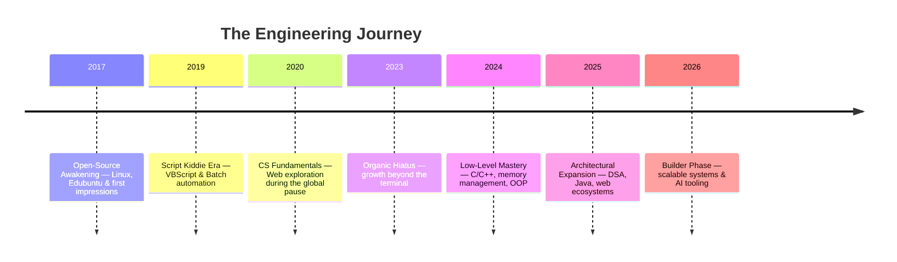

  

  

 

  &nbsp;
  &nbsp;
  &nbsp;
  &nbsp;
  &nbsp;
  

 

## `whoami`

I'm a third-year Computer Science & Engineering student at **CHARUSAT (DEPSTAR)**, working across full-stack architecture, applied data science, and web security — the same throughline that runs from a Data Structure Visualizer to a fake-news attribution research project to freelance production systems for real clients. I care about *why* a system is built the way it is before I care about the framework it's built in.

<table width="100%">
<tr>
<td width="50%" valign="top">

**Core Strengths**
- 🔍 Problem Analysis & Root-Causing
- 🧩 Systems-Level Problem Solving
- 🧠 Logical Reasoning
- 👥 Team Leadership & Ownership
- 📌 Project Management
- 🗣️ Technical Communication

</td>
<td width="50%" valign="top">

**Focus Areas**
- 🏗️ Full-Stack Architecture (Next.js / Node)
- 📊 Data Science, EDA & LLM Analytics
- 🔐 Web Security & Vulnerability Research
- 🎯 Forward Deployed Engineering track

</td>
</tr>
</table>

## How I Approach a Build

## Tech Arsenal

| Category | Stack |
|:---|:---|
| **Languages** |  |
| **System-Level** |    |
| **Frameworks** |  |
| **Databases** |     |
| **Cloud & DevOps** |    |
| **Data & Analytics** |     |
| **AI & LLMs** |     |
| **Security Tooling** |    |
| **Dev Tools & IDEs** |   |
| **OS** |  |

## Deployed Systems

| | Project | Description | Stack | Explore |
|:---:|:---|:---|:---|:---:|
| 🎓 | **ARCADE** | A centralized, role-based digital ecosystem unifying verified academic resources and structured learning roadmaps within a university environment. | React · Node.js · Express · MongoDB | [Architecture](https://swayam-patel-v1.vercel.app/architecture/arcade.html) |
| 🧠 | **BRAINBIN** | A smart knowledge management and note-taking tool for organizing thoughts, code snippets, and ideas in one place. | React · TypeScript · Next.js | [Architecture](https://swayam-patel-v1.vercel.app/architecture/brainbin.html) |
| 📈 | **DATAMIND** | An autonomous, LLM-powered EDA framework that auto-generates research questions, writes self-correcting analysis code, and visualizes insights from raw datasets. | Python · LLMs · Data Science · React | [Architecture](https://swayam-patel-v1.vercel.app/architecture/datamind.html) |
| 🌌 | **Wander-n-Wonder** | A premium digital-garden blogging platform with a frosted-glass reader UI and a private Creator Studio for drafting posts and tracking analytics. | Next.js · Markdown | [Live](https://wander-n-wonder.vercel.app) |
| 🧩 | **AI Logic Commenter** | A VS Code extension that auto-generates logic-focused documentation for selected code, powered by Gemini 2.5 Flash. | TypeScript · Gemini API | [Marketplace](https://marketplace.visualstudio.com/items?itemName=sp2736.logic-commenter) |
| 🌑 | **Dark Angel** | A deep-blue VS Code dark theme built for long coding sessions. | VS Code Theme | [Marketplace](https://marketplace.visualstudio.com/items?itemName=sp2736.dark-angel-by-sp) |
| ☀️ | **White Devil** | A crisp, minimal VS Code light theme built for clarity and daylight coding. | VS Code Theme | [Marketplace](https://marketplace.visualstudio.com/items?itemName=sp2736.white-devil-by-sp) |
| 🎵 | **Suno AI Tracks** | AI-generated music compositions — prompt-engineered original tracks across genres. | Generative Audio | [Listen](https://suno.com/@sp2736) |

Full write-ups, live demos, and case studies for every deployment live on the <a href="https://swayam-patel-v1.vercel.app">portfolio</a>.

## Client Work — Freelance

Available on Fiverr for full-stack builds, developer tooling, and AI integrations.

| Service | What's Delivered | Stack |
|:---|:---|:---|
| [Full-Stack Web Development](https://www.fiverr.com/swayampatel440/build-a-full-stack-web-app-using-react-next-js-and-node-js/) | Responsive UI · REST API · DB Schema · Deployment | Next.js · React · Node.js · MongoDB |
| [Persuasive Website Copy](https://www.fiverr.com/swayampatel440/write-persuasive-website-copy-that-converts-visitors-into-customers/) | Website Copy · Landing Pages · Brand Messaging | Copywriting · UX Writing |
| [SEO-Optimized Blog Posts](https://www.fiverr.com/swayampatel440/write-seo-optimized-blog-posts-and-articles-that-rank/) | SEO Articles · Keyword Research · Blog Posts | SEO · Content Strategy |

  

## Engineering Timeline

## Beyond the Terminal

**Author & Poet** — *Before I Learned Goodbye*, a 20-poem collection published by Bookleaf Publication (India | USA | UK), tracing the arc of a first love across 579 days.
📖 [View Publication](https://ebooks.bookleafpub.com/product-page/before-i-learned-goodbye)

| Domain | Interests |
|:---|:---|
| 🎵 Music & Sound | Listening · AI Music Creation via Suno |
| 🏃 Movement & Fitness | Gym · Cycling · Wall Punches |
| 🌍 Adventure & Travel | Travelling · Trekking · Adventure Activities |
| 🎨 Art & Expression | Sketching · Poetry & Writing |
| ☕ Daily Ritual | Coffee — always |

## Establish Connection

  &nbsp;
  &nbsp;
  &nbsp;
  
    
  

  

